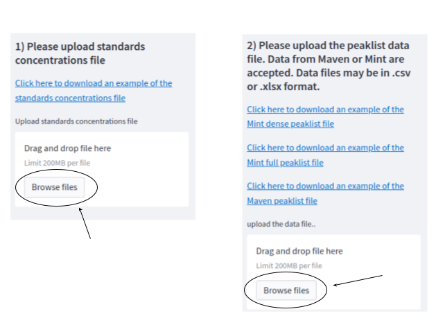
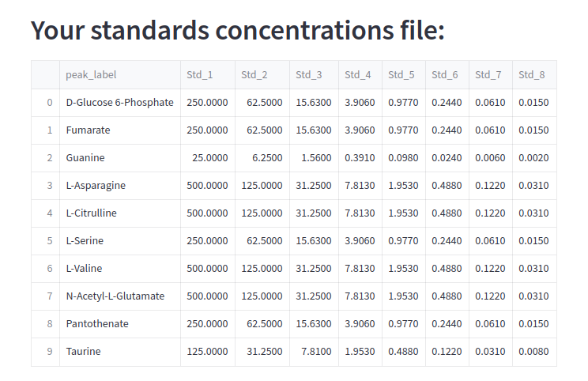
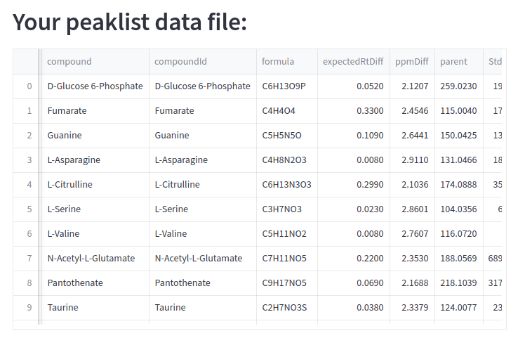
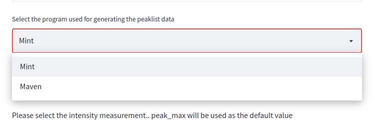
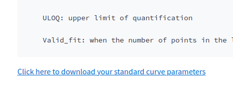
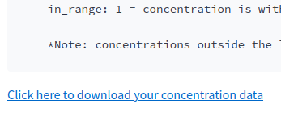
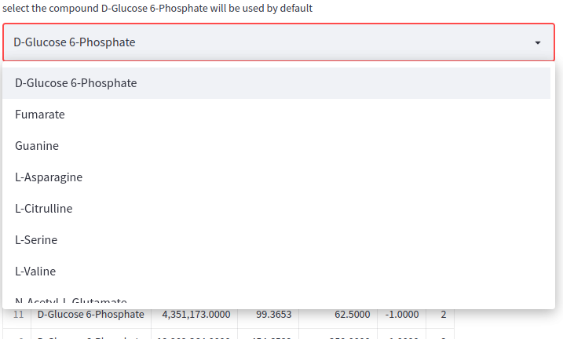
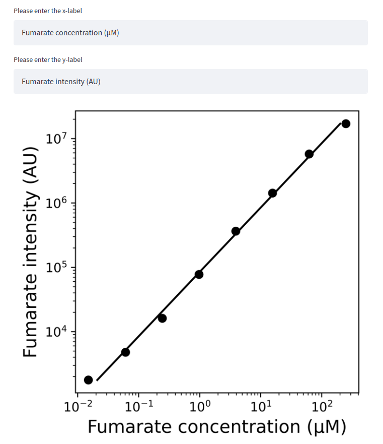

# ms-conc and SCALiR

This repository contains an app for standardizing metabolomics data by using standard samples that incorporates a novel algorithm for detecting linear ranges in a set of (x,y) points covering several orders of magnitude. The algorithm uses the log-scale to perform a search of the linear range by iteratively fitting a linear curve to the set of points. 
The points that are furthest from the fitted curve are removed from the range until reaching a proper fitting, where the residual of the curve is less than 0.01. The parameters controlling the goodness of fit and the criteria for stopping the iterative points elimination were selected by using mass spectrometry (MS) generated metabolomics data. 
Although the app is meant to use MS data, it can be used to standardize data with similar structures. 
SCALiR can be used freely online at https://lewisresearchgroup-ms-conc-streamlit-app-w9e64f.streamlit.app/, or locally by cloning this repo. 
Running locally allows for modifying parameters controlling the algorithm performance to better adjust your data.

The first step in the app is to provide signal itensities (e.g., peak area) data for each metabolite and the concentrations of metabolites in the standard samples in separate data files. 

The data of signal intensities can be obtained from Maven or MINT programs (this information should be specified). The data should be provided in tables (.csv or .xlsx extensions). 
Sample tables in the proper format can also be downloaded. 

The app will display the head of the tables after successfuly providing the signal intensities and standard concentrations information tables. 

The user should indicate which program was used to generate the signal intensities table since MAVEN and MINT export tables in different formats. 

After indicating the program, SCALiR will run automatically. 
The slope of the curve in the log scale can be modified although we recommend to use the default value (slope = 1.0).
Running SCALiR may take few seconds.
After successfuly running, the app will show a table with the parameters of the fitting and a table with the calculated concentrations. 

The user may also visually inspect the standard curves and the predicted linear ranges for each compound as well as download the log-scale standard curve graph for a specified compound.

